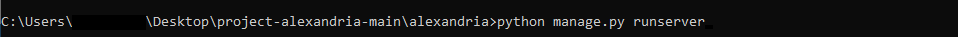
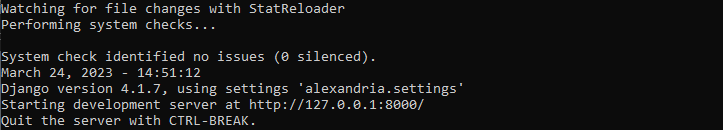

# project-alexandria

Plataforma web para o mapeamento e registro de projetos realizados pela rede Fecomercio, e comunicação com seu público.

* Este projeto foi desenvolvido para o evento DOJO TECH da rede Senac Tech em parceria com o Programa SOMAR.
* O projeto tem o objetivo de ser uma coleção dos projetos contribuentes ao ODS (Objetivos de Desenvolvimento Sustentável) da ONU e bandeiras Fecomercio

## Arquitetura

O projeto é construido em Python e usa como framework o Django.

### Detalhes:

* A implementação é feita em Python 3.
* Uso do framework Django.
* Os Templates são construidos com: HTML, CSS e JavaScript.
* Os browsers utilizados na fase de teste foram: Chrome 111.0 e Firefox 111.0.
* As IDE's utilizadas no desenvolvimento são: Visual Studio Code, Notepad++ e Vim.
* Os OS's utilizados foram: Windows e Arch Linux.
* O Banco de Dados usado é o SQLite

## Requisitos para a execução do projeto

* Python 3 instalado.
* Django 4.1.7 ou superior instalado.
* Port 8000 disponível.
* Um browser para o acesso a página no localhost (Preferencialmente Chrome ou Firefox).

## Execução do Código

**É recomendável a utilização da ferramenta Git para o controle de versões e agilidade no desenvolvimento.**

Faça o download do * main * atual e abra o diretório no Shell de seu OS de escolha.
Navegue até a pasta de localização do arquivo * manage.py *

Para iniciar o servidor de desenvolvimento no seu localhost, execute:
 

O terminal deve dar a seguinte resposta:
  

Abra o seu browser de escolha e acesse qualquer um dos links abaixo:
* 127.0.0.1:8000/
* localhost:8000/
